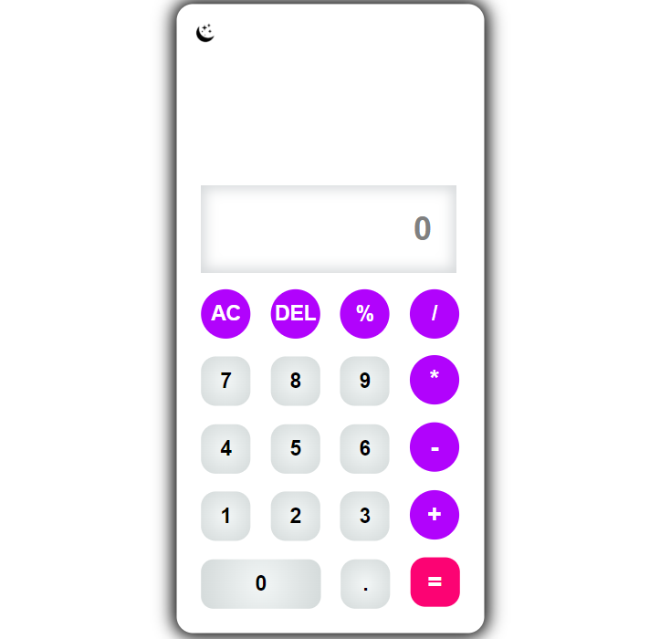
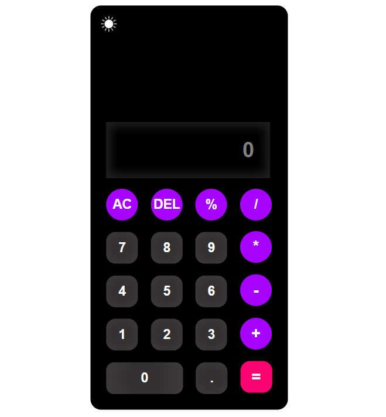

<h1>ABOUT THE PROJECT</h1>

<p>This is my first project which I have made with a lot of dedication. This is my first project after starting my coding journey. I made it during my polytechnic diploma. I have used HTML-CSS-JS to make it. This is a basic calculator and it can do only basic operations.</p>
<p>There is uploaded three files and two images of this project.<p/>
<ul>
   <a href="calculator.html"><li>HTML</li></a>
   <a href="calculator.css"><li>CSS</li></a>
   <a href="calculator.js"><li>JS</li></a>
   <a href="moon.png"><li>image1</li></a>
   <a href="sun.png"><li>image2</li></a>
</ul>
## 📂 Project Structure

```
/Login-and-Signup-form-using-HTML-CSS-JS
│
├── calculator.html        # Main HTML file containing both forms
├── calculator.css         # CSS for layout, colors, and responsiveness
├── calculatort.js         # JavaScript for form switching and validation
└── README.md              # Project documentation (this file)
|__ ☾ moon.png             # shift calculatot on dark mode
|__ ☀ sun.png             # shift calculatot on light mode
```

## 📸 Screenshots

### LIGHT MODE



### DARK MODE



---


<h3>Explain this HTML code</h3>
<P>This code snippet is an HTML document that defines the structure of a simple calculator web application.</P>
<p>!DOCTYPE html: This line indicates that the document is an HTML5 document.</p>
<p>Link to CSS: Links to an external stylesheet (calculator.css) which is used to style the calculator.</p>
<p>This HTML code sets up a basic structure for a calculator web application, including an input field for displaying numbers and buttons for various operations (clear, delete, percentage, division, multiplication, and subtraction). The calculator's appearance and layout would be controlled by the linked CSS file (calculator.css), which is not provided in this snippet.</p>

<h3>Explain this CSS code</h3>
<p>This code is a snippet of CSS (Cascading Style Sheets) that styles a webpage, specifically a calculator interface.</p>
<p>Overall, this CSS code sets a clean and modern style for a calculator interface, with a white background, rounded corners, and a shadow effect for depth. The layout is centered, and a toggle icon is positioned in the top-left corner. The use of Flexbox allows for responsive design, making it adaptable to various screen sizes.</p>

<h3>Explain this JS code</h3>
<p>This JavaScript code implements a simple calculator and a dark mode toggle feature for a web page.</p>
<p>This code provides the functionality of a basic calculator that can perform arithmetic operations, clear inputs, and delete the last character. It also includes a feature to toggle between light and dark modes for the web page interface, enhancing user experience.</p>

<H1>EXPLAINATION OF THIS CALCULATOR PROJECT</H1>
<P>The calculator project is a simple web-based application that allows users to perform basic arithmetic operations (addition, subtraction, multiplication, and division) through a graphical user interface. Here’s a summary of its key features and functionalities:</P>

<h3>Key Features</h3>
<ol>
  <li><b>User Interface:</b></li>
    <ul>
      <li>The calculator has an input box where the current expression or result is displayed.</li>
      <li>It includes buttons for numbers (0-9), basic arithmetic operators (+, -, *, /), and special functions such as:</li>
      <li>Equal (=): Evaluates the current expression.</li>
      <li>All Clear (AC): Clears the input and resets the calculator.</li>
      <li>Delete (DEL): Removes the last character from the current input.</li>
    </ul>
  
  <li><b>Event Handling:</b></li>
    <ul>
      <li>Each button has an event listener that responds to user clicks, updating the displayed input accordingly.</li>
      <li>The calculator can evaluate expressions using JavaScript's eval() function when the equal button is pressed.</li>
    </ul>
    
  <li><b>Dark Mode Toggle:</b></li>
     <ul>
       <li>he project includes a toggle feature that allows users to switch between light and dark modes for better accessibility and user preference.</li>
       <li>An icon (likely a sun or moon) indicates the current mode and changes when toggled.</li>
     </ul>
</ol>

<h3>Technical Implementation</h3>
  <li>The project uses JavaScript for functionality, HTML for structure, and CSS (implied) for styling.</li>
  <li>The calculator maintains a string to build the input expression and updates the display based on user interactions.</li>
  
<h2>Overall Summary</h2>
<p>Overall, this calculator project demonstrates fundamental web development skills, including DOM manipulation, event handling, and user interface design, while providing a functional tool for basic mathematical calculations and a user-friendly experience with a dark mode feature.</p>

**Made with ❤️ by [GAURAV-InnovativeCodeZone](https://github.com/GAURAV-InnovativeCodeZone)**
